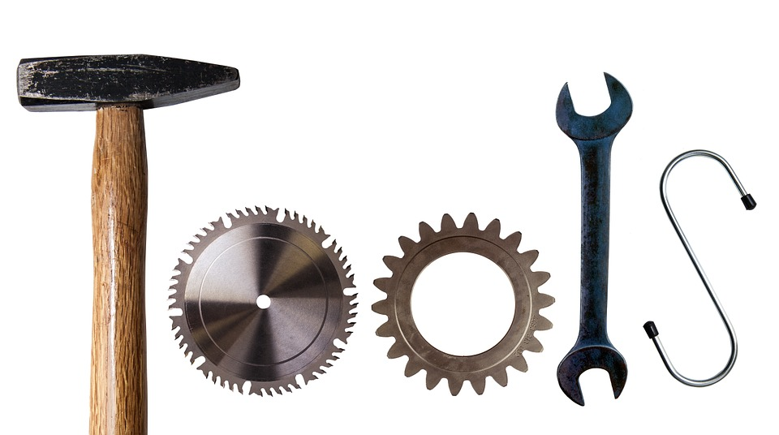

blogtools 
============

**blogtools** is tools for blogging.

Installation
============

To download the development version of **blogtools**:

Download the [zip
ball](https://github.com/data-steve/blogtools/zipball/master) or [tar
ball](https://github.com/data-steve/blogtools/tarball/master), decompress and
run `R CMD INSTALL` on it, or use the **pacman** package to install the
development version:

    if (!require("pacman")) install.packages("pacman")
    pacman::p_load_gh("data-steve/blogtools")

Contact
=======

You are welcome to: 
- submit suggestions and bug-reports at: <https://github.com/data-steve/blogtools/issues> 
- send a pull request on: <https://github.com/data-steve/blogtools/> 
- compose a friendly e-mail to: <steven.troy.simpson@gmail.com>
